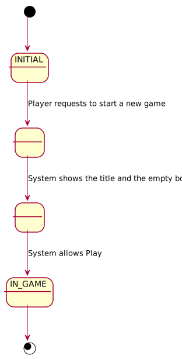
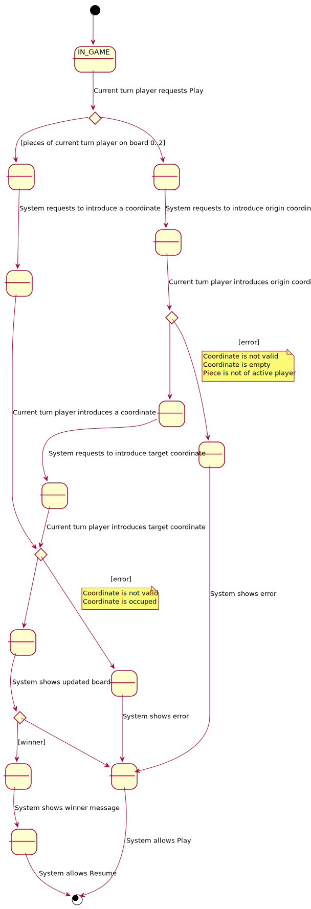
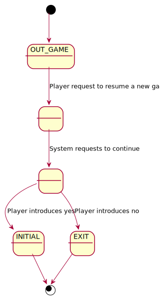

# game-ticTacToe.1.0.basic
Universo Santa Tecla  
[uSantaTecla@gmail.com](mailto:uSantaTecla@gmail.com)  
  
## useCaseView 

* [requirements](#requirements)  
* [actorsUseCaseDiagram](#actorsUseCaseDiagram)   
* [useCaseContextDiagram](#useCaseContextDiagram)
* [useCaseSpecification](#useCaseSpecification)
    * [startUseCaseSpecification](#startUseCaseSpecification)
    * [playUseCaseSpecification](#playUseCaseSpecification)
    * [resumeUseCaseSpecification](#resumeUseCaseSpecification)   
* [interfacePrototype](#interfacePrototype)   

### requirements 

* _glosary: **[ticTacToe](../README.md)**_
* _functionality: **basic**_
* _interface: **console**_
* _distribution: **standalone**_
* _persistence: **not**_

### actorsUseCaseDiagram


### useCaseContextDiagram


### useCaseSpecification

#### startUseCaseSpecification
 
  

#### playUseCaseSpecification

  

#### resumeUseCaseSpecification

  

### interfacePrototype
  
```
--- TIC TAC TOE ---
-------------
|   |   |   |
|   |   |   |
|   |   |   |
-------------
Enter a coordinate to put a token:
Row: 4
Column: -1
The coordinates are wrong
Enter a coordinate to put a token:
Row: 1
Column: 1
-------------
| X |   |   |
|   |   |   |
|   |   |   |
-------------
Enter a coordinate to put a token:
Row: 1
Column: 1
The square is not empty
Enter a coordinate to put a token:
Row: 1
Column: 2
-------------
| X | O |   |
|   |   |   |
|   |   |   |
-------------
Enter a coordinate to put a token:
Row: 2
Column: 2
-------------
| X | O |   |
|   | X |   |
|   |   |   |
-------------
Enter a coordinate to put a token:
Row: 3
Column: 3
-------------
| X | O |   |
|   | X |   |
|   |   | O |
-------------
Enter a coordinate to put a token:
Row: 1
Column: 3
-------------
| X | O | X |
|   | X |   |
|   |   | O |
-------------
Enter a coordinate to put a token:
Row: 3
Column: 1
-------------
| X | O | X |
|   | X |   |
| O |   | O |
-------------
Origin coordinate to move
Row: 3
Column: 1
There is not a token of yours
Origin coordinate to move
Row: 1
Column: 1
Target coordinate to move
Row: 1
Column: 1
The origin and target squares are the same
Target coordinate to move
Row: 3
The origin and target squares are the same
Target coordinate to move
Row: 3
Column: 1
The square is not empty
Target coordinate to move
Row: 3
Column: 2
-------------
|   | O | X |
|   | X |   |
| O | X | O |
-------------
Origin coordinate to move
Row: 1
Column: 2
Target coordinate to move
Row: 1
Column: 1
-------------
| O |   | X |
|   | X |   |
| O | X | O |
-------------
Origin coordinate to move
Row: 1
Column: 3
Target coordinate to move
Row: 1
Column: 2
-------------
| O | X |   |
|   | X |   |
| O | X | O |
-------------
X Player: You win!!! :-)
Do you want to continue? (y/n):
```
