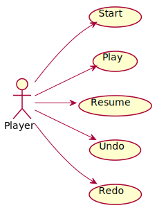

# TicTacToe. Requisitos Undo/Redo
Universo Santa Tecla  
[uSantaTecla@gmail.com](mailto:uSantaTecla@gmail.com)  
  
**Índice**

1. [Requisitos](#requisitos)  
2. [Vista de Casos de Uso](#vista-de-casos-de-uso)  
2.1. [Vista de Caso de Uso Start](#vista-de-caso-de-uso-start)  
2.2. [Vista de Caso de Uso Play](#vista-de-caso-de-uso-play)  
2.3. [Vista de Caso de Uso Undo](#vista-de-caso-de-uso-undo)  
2.4. [Vista de Caso de Uso Redo](#vista-de-caso-de-uso-redo)  
2.5. [Vista de Caso de Uso Resume](#vista-de-caso-de-uso-resume)  
2.6. [Prototipo de Interfaz](#prototipo-de-interfaz)  
2.6.1. [Consola](#consola)  

## Requisitos  

| * _Funcionalidad: **Básica + Undo/Redo**_<br/>  * _Interfaz: **Gráfica y Texto**_<br/>  * _Distribución: **Standalone**_<br/>  * _Persistencia: **No**_<br/> |  | 
| :------- | :------: |  

## Vista de Casos de Uso  

| Diagrama de Actores y Casos de Uso | Diagrama de Contexto |
|---|---|
|  | .svg) |  

## Vista de Caso de Uso Start  
  

## Vista de Caso de Uso Play  
  

## Vista de Caso de Uso Undo  
  

## Vista de Caso de Uso Redo  
  

## Vista de Caso de Uso Resume  
 

### Prototipo de Interfaz  

#### Consola  

```
--- TIC TAC TOE ---
---------------
 |   |   |   | 
 |   |   |   | 
 |   |   |   | 
---------------

----- Choose one option -----
1) Do a action
1
Enter a coordinate to put a token:
Row: 1
Column: 1
---------------
 | X |   |   | 
 |   |   |   | 
 |   |   |   | 
---------------

----- Choose one option -----
1) Do a action
2) Undo previous action
1
Enter a coordinate to put a token:
Row: 2
Column: 1
---------------
 | X |   |   | 
 | O |   |   | 
 |   |   |   | 
---------------

----- Choose one option -----
1) Do a action
2) Undo previous action
2
---------------
 | X |   |   | 
 |   |   |   | 
 |   |   |   | 
---------------

----- Choose one option -----
1) Do a action
2) Undo previous action
3) Redo previous action
3
---------------
 | X |   |   | 
 | O |   |   | 
 |   |   |   | 
---------------

----- Choose one option -----
1) Do a action
2) Undo previous action
1
Enter a coordinate to put a token:
Row: 1
Column: 2
---------------
 | X | X |   | 
 | O |   |   | 
 |   |   |   | 
---------------

----- Choose one option -----
1) Do a action
2) Undo previous action
1
Enter a coordinate to put a token:
Row: 2
Column: 2
---------------
 | X | X |   | 
 | O | O |   | 
 |   |   |   | 
---------------

----- Choose one option -----
1) Do a action
2) Undo previous action
1
Enter a coordinate to put a token:
Row: 1
Column: 3
---------------
 | X | X | X | 
 | O | O |   | 
 |   |   |   | 
---------------
X player: You win!!! :-)
Do you want to continue? (y/n): 
```

