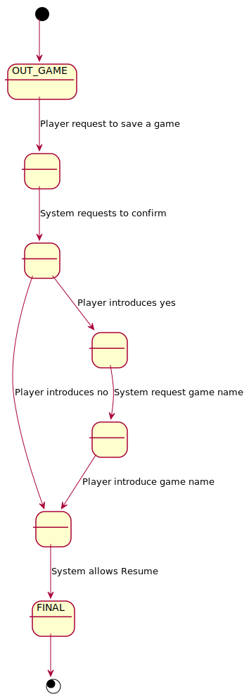
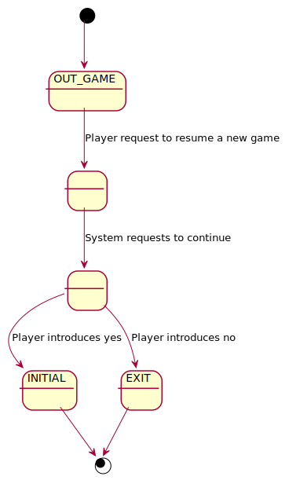

# TicTacToe. Requisitos Ficheros
Universo Santa Tecla  
[uSantaTecla@gmail.com](mailto:uSantaTecla@gmail.com)  
  
**Índice**

1. [Requisitos](#requisitos)  
2. [Vista de Casos de Uso](#vista-de-casos-de-uso)  
2.1. [Vista de Caso de Uso Start](#vista-de-caso-de-uso-start)  
2.2. [Vista de Caso de Uso Open](#vista-de-cas-de-uso-open)  
2.3. [Vista de Caso de Uso Play](#vista-de-caso-de-uso-play)  
2.4. [Vista de Caso de Uso Undo](#vista-de-caso-de-uso-undo)  
2.5. [Vista de Caso de Uso Redo](#vista-de-caso-de-uso-redo)  
2.6. [Vista de Caso de Uso Exit](#vista-de-cas-de-uso-exit)  
2.7. [Vista de Caso de Uso Save](#vista-de-cas-de-uso-save)  
2.8. [Vista de Caso de Uso Resume](#vista-de-caso-de-uso-resume)  
2.9. [Prototipo de Interfaz](#prototipo-de-interfaz)  
2.9.1. [Consola](#consola)  
3. [Analisis](#analisis)  
   3.1. [Casos de Uso](#casos-de-uso)  
      3.1.1. [Analisis Start](#analisis-start)  
      3.1.2. [Analisis Open](#analisis-open)  
      3.1.3. [Analisis Propose](#analisis-propose)  
      3.1.4. [Analisis Undo](#analisis-undo)  
      3.1.5. [Analisis Redo](#analisis-redo)  
      3.1.6. [Analisis Exit](#analisis-exit)  
      3.1.7. [Analisis Save](#analisis-save)  
      3.1.8. [Analisis Resume](#analisis-resume)  
   3.2. [Paquetes](#paquetes)  
      3.2.1. [Vistas](#vistas)  
      3.2.2. [Controladores](#controladores)  
      3.2.3. [Modelos](#modelos)  
      3.2.4. [Types](#types)  
4. [Diseño](#diseño)  
   4.1. [Vista de Despliegue](#vista-de-despliegue)  
   4.2. [Vista de Participantes](#vista-de-participantes)  
   4.3. [Vista de Interaccion de Participantes](#vista-de-interaccion-de-participantes)  
  
## Requisitos  

| * _Funcionalidad: **Básica + Undo/Redo**_<br/>  * _Interfaz: **Gráfica y Texto**_<br/>  * _Distribución: **Standalone + Client/Server**_<br/>  * _Persistencia: **Ficheros**_<br/> |  | 
| :------- | :------: |  

## Vista de Casos de Uso  

| Diagrama de Actores y Casos de Uso | Diagrama de Contexto |
|---|---|
|  | .svg) |  

## Vista de Caso de Uso Start  
  

## Vista de Caso de Uso Open
  

## Vista de Caso de Uso Play  
  

## Vista de Caso de Uso Undo  
  

## Vista de Caso de Uso Redo  
  

## Vista de Caso de Uso Exit
  

## Vista de Caso de Uso Save
  

## Vista de Caso de Uso Resume  
 

### Prototipo de Interfaz  

#### Consola  
```
--- TIC TAC TOE ---
----- Choose one option -----
1) Start a new game
2) Open a saved game
1
Number of users [0-2] 1
----- Choose one option -----
1) Do a movement
2) Exit game
1
---------------
| - | - | - |
| - | - | - |
| - | - | - | 
---------------
Enter a coordinate to put a token:
Row: 1
Column: 1
---------------
| X | - | - |
| - | - | - |
| - | - | - |
---------------
----- Choose one option -----
1) Do a movement
2) Undo previous movement
3) Exit game
1
---------------
| X | - | - |
| - | - | - |
| - | - | - |
---------------
---------------
| X | - | O |
| - | - | - |
| - | - | - | 
---------------
----- Choose one option -----
1) Do a movement
2) Undo previous movement
3) Exit game
1
---------------
| X | - | O |
| - | - | - |
| - | - | - |
---------------
Enter a coordinate to put a token:
Row: 2
Column: 1
---------------
| X | - | O |
| X | - | - | 
| - | - | - |
---------------
----- Choose one option -----
1) Do a movement
2) Undo previous movement
3) Exit game
1
---------------
| X | - | O |
| X | - | - |
| - | - | - |
---------------
---------------
| X | - | O |
| X | - | O |
| - | - | - |
---------------
----- Choose one option -----
1) Do a movement
2) Undo previous movement
3) Exit game
3
Do you want to save the game?? (y/n): y
Name: game1
Do you want to continue? (y/n): y

--- TIC TAC TOE ---
----- Choose one option -----
1. Start a new game
2. Open a saved game
2
----- Choose one option -----
1. game1.mm
1
game1.mm
---------------
| X | - | O |
| X | - | O |
| - | - | - |
---------------
----- Choose one option -----
1) Do a movement
2) Undo previous movement
3) Exit game
1
---------------
| X | - | O |
| X | - | O |
| - | - | - |
---------------
Enter a coordinate to put a token:
Row: 3
Column: 1
---------------
| X | - | O |
| X | - | O |
| X | - | - |
---------------
X Player: You win!!! :-)
Do you want to save the game?? (y/n): n
Do you want to continue? (y/n):
```

## Analisis  
  

## Casos de Uso  

### Analisis Start  
  

### Analisis Open


### Analisis Play 
  

### Analisis Undo 
  

### Analisis Redo 
  

### Analisis Exit


### Analisis Save


### Analisis Resume  
  

## Paquetes  
  

### Vistas  
  

### Controladores  
  

### Modelos  
  

### Types  
  

## Diseño  

### Vista de Despliegue  
  

### Vista de Participantes  
  

### Vista de Interaccion de Participantes  
  