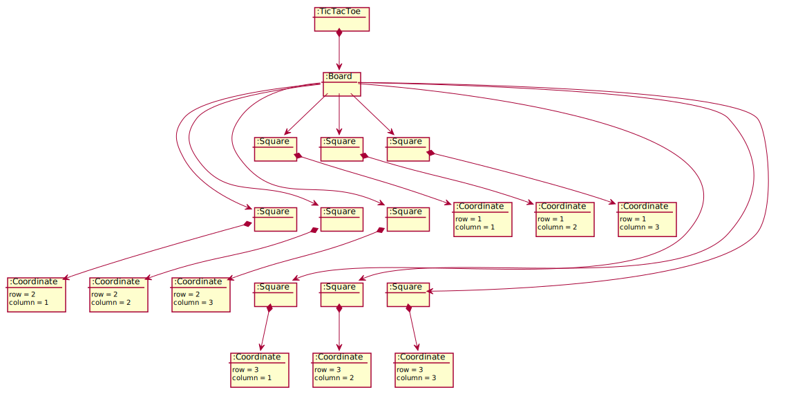
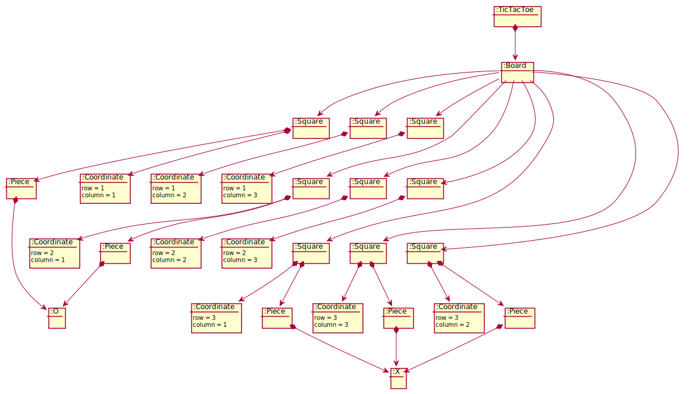
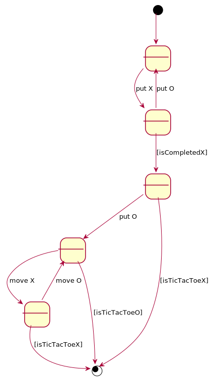
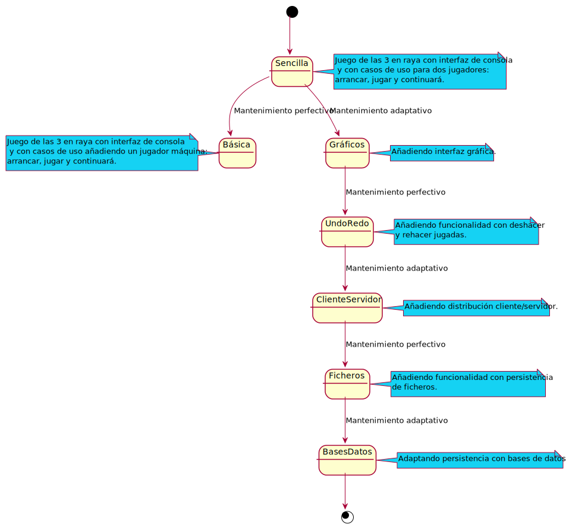

# ticTacToe
Universo Santa Tecla  
[uSantaTecla@gmail.com](mailto:uSantaTecla@gmail.com)  
  
## index

* [domainModel](#domainModel)  
    * [vocabulary](#vocabulary)  
    * [initialState](#initialState)  
    * [finalState](#finalState)
    * [instructions](#instructions)  
* [versions](#versions)
    * [0.dataLanguage](./0.dataLangauges/README.md)
    * [0.publicationLanguage](./0.publicationLanguage/README.md)
    * [1.basic](./1.basic/README.md)
    * [1.1.machine](./1.1.machine/README.md)
    * [2.graphics](./2.graphics/README.md)
    * [3.undoRedo](./3.undoRedo/README.md)
    * [4.distributed](./3.undoRedo/README.md)
    * [5.files](./4.files/README.md)
    * [6.bbdd](./5.bbdd/README.md)

## domainModel  
  
  
  
### vocabulary

  
  
### initialState  
  
  
  
### finalState 

* Objetivo TicTacToe en 3ª fila

  
  
### instructions  
  
  
  
## versions  
  
  
